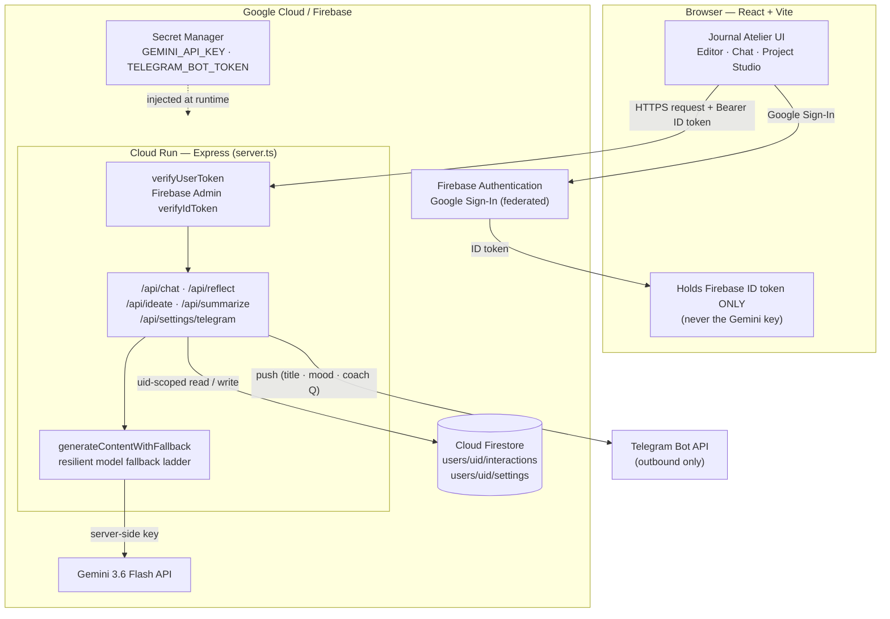
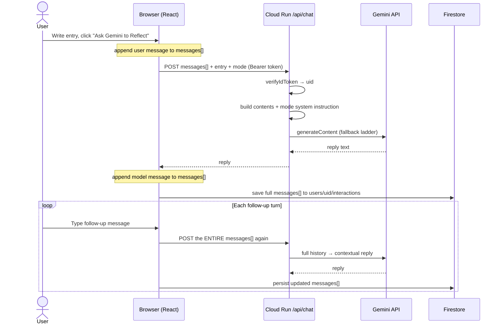
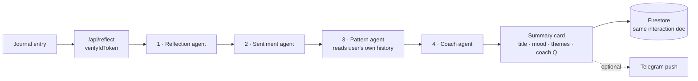
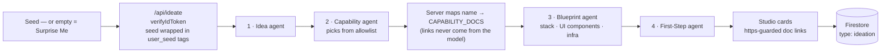

# Architecture & Security

> **Non-negotiable rule:** every Gemini API call runs in server-side code on Cloud Run.
> The browser only ever holds a Firebase **ID token** — never the Gemini API key.

This document details the security posture and system design of Journal Atelier.
For setup and deployment see [DEPLOYMENT.md](./DEPLOYMENT.md); for the full
walkthrough test matrix see [TESTING.md](./TESTING.md).

---

## Security Highlights

### 1. Passwordless, federated authentication
- Credentials are outsourced entirely to **Firebase Authentication** via federated Google Sign-In.
- No emails, plaintext passwords, or hashing logic are handled in application state.
- The client sends cryptographically signed JWT tokens (`Authorization: Bearer <idToken>`)
  to server-side endpoints, where every request is verified with the **Firebase Admin SDK**
  (`verifyIdToken` — signature, issuer, audience, expiry). Forged or tampered tokens are
  rejected; the `uid` is trusted only because the signature proved it.

### 2. Strict Firestore data isolation
- Every journal entry, chat interaction, and AI reflection is saved under the
  user-specific path `/users/{userId}/interactions/{interactionId}`.
- Firestore security rules strictly enforce `request.auth.uid == userId`, preventing
  any cross-tenant data leaks.
- A recursive payload sanitizer removes `undefined` properties before every database
  write to prevent driver crashes.

### 3. Gemini 3.6 Flash resilient fallback ladder
Server-side helper `generateContentWithFallback` wraps `@google/genai` with an
automated fallback ladder:

1. Primary: `gemini-3.6-flash`
2. High-availability: `gemini-3.1-flash-lite`
3. Dynamic alias: `gemini-flash-latest`
4. Deep reasoning: `gemini-3.7-flash`

It catches recoverable API codes (`503 UNAVAILABLE`, `429 RESOURCE_EXHAUSTED`,
`404 NOT_FOUND`, `500 INTERNAL`) and retries the next model before escalating an
error to the UI.

### 4. Zero hardcoded secrets
`GEMINI_API_KEY` (and the optional `TELEGRAM_BOT_TOKEN`) are kept strictly server-side
in environment variables or **Google Cloud Secret Manager**, injected into Cloud Run at
runtime. No key ever reaches client code, committed config, or the repository.

### 5. Multi-agent reflection brain
- Each entry is routed server-side through four specialist agents — **Reflection**,
  **Sentiment**, **Pattern**, and **Coach** — orchestrated behind a single `/api/reflect`
  endpoint, all reusing the resilient fallback ladder.
- The **Pattern** agent surfaces recurring themes from the user's own history; its
  Firestore read path is hardcoded to `/users/{uid}/interactions` with `uid` bound only
  from the verified ID token — never from the request body or model output — so themes
  can never cross tenants.
- The journal entry is treated as untrusted data inside a delimited block (never as
  instructions), defending against indirect prompt injection (OWASP LLM01). A single
  agent's failure degrades gracefully without failing the run.

### 6. Outbound-only Telegram notifications
- Optional real-time push notifications to the user's Telegram chat on reflection synthesis.
- **Outbound-only & closed-loop**: no inbound webhooks, bot commands, or polling.
- Destination host is strictly hardcoded to
  `https://api.telegram.org/bot<token>/sendMessage` (SSRF prevention).
- Minimal payload: sends only the suggested title, sentiment tag, and Coach question
  (plain text, escaped) — never the full raw journal text.
- `TELEGRAM_BOT_TOKEN` is maintained server-side via Secret Manager; chat IDs are stored
  isolated at `/users/{uid}/settings/telegram`.

### 7. AI Project Studio (ideation brain)
- A dedicated brainstorming surface where users generate novel AI project concepts from
  an optional seed (or "Surprise Me" for a random idea), routed server-side through four
  specialist agents behind a single `/api/ideate` endpoint — **Idea**, **Capability**,
  **Blueprint**, and **First-Step** — all reusing the resilient fallback ladder.
- **Server-controlled reference links (LLM05 defense):** the model never emits URLs. The
  Capability agent returns only a capability *name* constrained to an allowlist; the server
  maps it to a curated `CAPABILITY_DOCS` doc URL. Unknown capability → no link. The UI
  renders links only when they begin with `https://` and always with
  `rel="noopener noreferrer"`, so no hallucinated or malicious URL can reach the user.
- The user seed is treated as untrusted data inside a `<user_seed>` block (never as
  instructions), defending against indirect prompt injection (OWASP LLM01). Agents are
  instructed never to emit secrets, API keys, or `curl | bash` steps. A single agent's
  failure degrades gracefully; results persist as a `type: "ideation"` document under
  `/users/{uid}/interactions` with all `undefined` fields stripped.
- Generated ideas can be **saved to history** (as a `brainstorm` interaction) and exported
  as a **provider-agnostic Markdown build spec** (Download or Copy). The spec is composed
  strictly from idea-derived fields and contains zero secrets, keys, or credentials.

### 8. Personal PIN privacy lock
- Users can lock individual entries behind a personal 4–6 digit PIN. While the session is
  locked, a locked entry is masked in the sidebar — title, body preview, mood badge, and
  tag badges all hidden — until the correct PIN is entered.
- **Privacy control, not encryption — stated honestly.** This is a UI-level screen-privacy
  layer that guards against shoulder-surfing and shared or unlocked devices. Entry text is
  still stored in plaintext under the user's isolated Firestore path and remains readable
  server-side, so Gemini reflection on locked entries is unaffected. It is **not**
  zero-knowledge encryption, and the "Set a journal PIN" modal says exactly that in plain
  language so the protection is never over-trusted.
- **The PIN is never stored raw.** Only a 16-byte random salt and a **PBKDF2-SHA256 hash
  (100,000 iterations)**, derived in the browser via built-in Web Crypto, are persisted —
  at `/users/{uid}/settings/security`, covered by the same owner-bound
  `request.auth.uid == userId` rule. The PIN is never transmitted to the server or logged,
  and verification uses a length-safe, constant-time comparison (`safeEqual`).
- **Bypass-resistant by design.** While the session is locked, a masked card renders **no**
  lock or delete controls (`{!isMasked && …}`), so a protected entry cannot be revealed,
  unlocked, or deleted without first entering the PIN. Locked entries are also excluded from
  sidebar search, so no keyword, mood, or tag can leak via substring match. Unlock state is
  held **in memory only** and re-locks automatically on page reload or sign-out.

---

## Diagrams

> Rendered natively by GitHub. The browser only ever holds a Firebase **ID token** —
> the Gemini API key lives server-side on Cloud Run and is never shipped to the client.

### System architecture

### Reflection & multi-turn chat (`/api/chat`)

The server is **stateless** — it remembers nothing between calls. The full conversation
history lives in the browser's `messages[]` array (and is mirrored to Firestore). Every
turn re-sends the entire history so Gemini stays in context.

### Multi-agent synthesize (`/api/reflect`)

A one-shot analysis (not a conversation). Four agents run in sequence; the **Pattern**
agent reads only the signed-in user's own history, bound to the token-derived uid.

### Project Studio ideation (`/api/ideate`)

Generates a project concept. The seed is wrapped as untrusted data; reference links are
attached **by the server** from a curated allowlist — never generated by the model.

